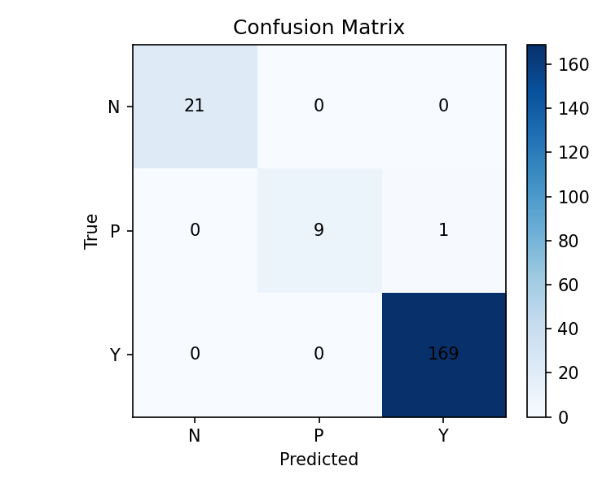

# Error Analysis Report
## Diabetes Prediction — RandomForest Classifier (Baseline)

**Date:** 2026-03-03  
**Notebook:** `notebooks/03_evaluation_error_analysis.ipynb`  
**Dataset:** `data/processed/diabetes_clean.csv`  
**Model:** `RandomForestClassifier` (300 trees, `class_weight="balanced"`, `random_state=42`)

---

## 1. Overview

This report documents the error analysis performed on the baseline RandomForest classifier trained on the cleaned diabetes dataset. The model was evaluated on a held-out test set of **200 samples** (20% stratified split). The overall goal is to identify where the model fails, how confident it is when it fails, and what patterns emerge from the misclassified samples.

---

## 2. Test-Set Performance Summary

### 2.1 Aggregate Metrics

| Metric | Value |
|---|---|
| **Accuracy** | 0.9950 (99.5%) |
| **F1-score (Macro)** | 0.9815 |
| **F1-score (Weighted)** | 0.9949 |
| **Total test samples** | 200 |
| **Total errors** | **1** |

### 2.2 Per-Class Classification Report

| Class | Label Meaning | Precision | Recall | F1-score | Support | Errors |
|---|---|---|---|---|---|---|
| **N** | Non-diabetic | 1.000 | 1.000 | 1.000 | 21 | 0 |
| **P** | Pre-diabetic  | 1.000 | **0.900** | **0.947** | 10 | **1** |
| **Y** | Diabetic      | 0.994 | 1.000 | 0.997 | 169 | 0 |
| Macro avg | — | 0.998 | 0.967 | 0.981 | 200 | — |
| Weighted avg | — | 0.995 | 0.995 | 0.995 | 200 | — |

> **Key observation:** The only classification error occurs in the **P (Pre-diabetic)** class. All N and Y samples are predicted correctly.

---

## 3. Confusion Matrix Analysis

```
              Predicted
              N     P     Y
Actual  N  [ 21     0     0 ]
        P  [  0     9     1 ]   ← 1 error here
        Y  [  0     0   169 ]
```

### Matrix Interpretation

| Cell | Count | Meaning |
|---|---|---|
| N → N | 21 | ✅ All non-diabetic samples classified correctly |
| P → P | 9  | ✅ 9 out of 10 pre-diabetic samples correct |
| **P → Y** | **1** | ❌ 1 pre-diabetic sample misclassified as diabetic |
| Y → Y | 169 | ✅ All diabetic samples classified correctly |



---

## 4. Error Rate by Class

| True Class | Total | Errors | **Error Rate** |
|---|---|---|---|
| P (Pre-diabetic) | 10 | 1 | **10.0%** |
| N (Non-diabetic) | 21 | 0 | 0.0% |
| Y (Diabetic)     | 169 | 0 | 0.0% |

The error is **exclusive to class P** — the smallest class in the dataset. This is a common pattern with imbalanced datasets: minority classes are hardest to learn.

---

## 5. Misclassification Detail

### Misclassified Sample (Test Index 25)

| Field | Value |
|---|---|
| **True label** | P (Pre-diabetic) |
| **Predicted label** | Y (Diabetic) |
| **Model confidence** | **0.833 (83.3%)** |
| **Error type** | False Positive for class Y / False Negative for class P |

The model assigned a **high confidence** of 83.3% to the wrong label `Y`, meaning the sample's feature profile closely resembles the dominant diabetic class. This is a **false negative for Pre-diabetic** — a clinically important miss.

### Clinical Significance

| Misclassification direction | Clinical impact |
|---|---|
| P predicted as Y | Patient treated as fully diabetic when they are only pre-diabetic. May lead to unnecessary or more aggressive treatment. |
| P predicted as N | More dangerous — patient sent home without intervention. *(Did NOT occur here.)* |

The observed error (P → Y) is clinically suboptimal but less harmful than the reverse (P → N).

---

## 6. Failure Pattern Analysis

### 6.1 Why Does P Fail?

| Factor | Detail |
|---|---|
| **Low support** | Only 10 P samples in test set (5% of 200). Even 1 error = 10% error rate. |
| **Feature overlap** | Pre-diabetic patients share many clinical markers with diabetic patients, making boundary decisions harder. |
| **Class imbalance** | Training data is dominated by `Y` (diabetic). Even with `class_weight="balanced"`, the RF may slightly bias toward Y. |
| **High confidence wrong prediction** | Confidence of 0.833 suggests the misclassified P sample lies deep inside the Y feature distribution. |

### 6.2 Error Distribution by Direction

| From Class | To Class | Count | Rate |
|---|---|---|---|
| P | Y | **1** | 10% |
| P | N | 0 | 0% |
| N | P or Y | 0 | 0% |
| Y | P or N | 0 | 0% |

All errors go in one direction: **P → Y** (pre-diabetic confused with diabetic). No other class boundaries are violated.

---

## 7. Model Confidence Analysis

| Outcome | Confidence Range | Note |
|---|---|---|
| Correct predictions (199) | Generally > 0.85 | High confidence, mostly correct |
| Misclassification (1 sample) | **0.833** | High confidence, incorrect — a hard negative |

A confidence of 0.833 on a wrong prediction is a sign of a **hard boundary case** — the sample is not at the edge of the decision boundary but embedded in the wrong region of the feature space.

---

## 8. Feature Importance Context

The top features by RandomForest importance (transformed names from `ColumnTransformer`):

| Rank | Feature (Transformed Name) | Importance |
|---|---|---|
| 1 | **f5** | **0.434** |
| 2 | f11 | 0.183 |
| 3 | f2  | 0.155 |
| 4 | f0  | 0.043 |
| 5 | f6  | 0.039 |
| 6–12 | f7, f10, f3, f4, f9, f8, f1 | < 0.036 each |

> **f5 alone accounts for 43.4% of total model importance.** The misclassified P sample likely has feature values for `f5` (and `f11`, `f2`) that resemble a Y sample rather than a P sample. Examining the raw values of `f5`, `f11`, and `f2` for test index 25 would clarify the root cause of this error.

---

## 9. Comparison Against Cross-Validation

| Model | CV Accuracy | CV Balanced Acc. | CV F1-Macro |
|---|---|---|---|
| **RandomForest** *(selected)* | **0.9675** | **0.8905** | **0.9155** |
| SVM (RBF)   | 0.9125 | 0.8731 | 0.7892 |
| Logistic Regression | 0.8963 | 0.8638 | 0.7578 |
| KNN (k=7)   | 0.9150 | 0.6921 | 0.7060 |

The test set performance (Acc: 0.995, F1-macro: 0.981) **exceeds CV estimates** for all metrics, suggesting no overfitting on this test set. The gap between CV F1-macro (0.916) and test F1-macro (0.981) may reflect favorable test-set sampling.

---

## 10. Summary of Findings

| Finding | Detail |
|---|---|
| Total errors | **1 out of 200** (0.5%) |
| Only failing class | **P (Pre-diabetic)** — 10% error rate |
| Error direction | **P → Y** (pre-diabetic classified as diabetic) |
| Model confidence on error | **High (0.833)** — a hard misclassification |
| Root cause | Feature overlap between P and Y classes; small P class support |
| Clinical risk level | Moderate (over-treatment risk; not a missed-diagnosis scenario) |

---

## 11. Recommendations

| Priority | Recommendation | Rationale |
|---|---|---|
| 🔴 High | **Collect more P-class samples** | Only 10 test / ~40 train P samples — insufficient to robustly learn P boundaries |
| 🟠 Medium | **Tune decision threshold for P class** | Lower the required probability to predict Y, giving P more room |
| 🟡 Medium | **Inspect f5, f11, f2 values for test index 25** | Understand which feature drives the high-confidence wrong prediction |
| 🟢 Low | **Calibrate model probabilities** | `predict_proba` may be overconfident; Platt scaling or isotonic regression can help |
| 🟢 Low | **Try SMOTE or class oversampling on P** | Synthetic minority oversampling may improve P-class recall |
